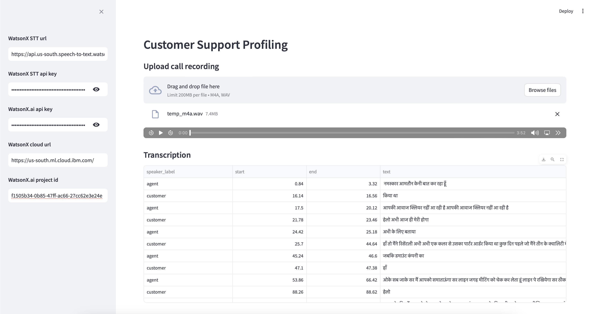
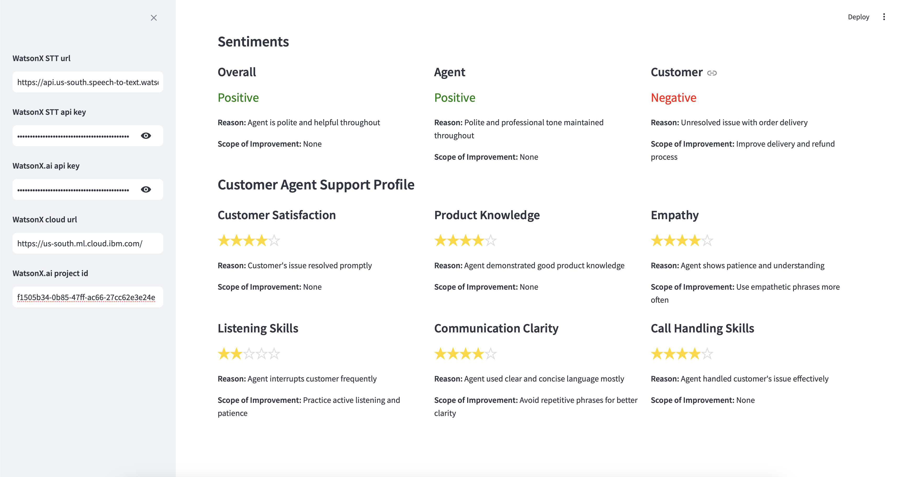

# Customer Support Analyzer

## Introduction

Customer Support Analyzer is an intuitive AI-driven application that analyzes hindi customer support call recording to generate detailed profile of the customer support agent. The app transcribes the call recording using Speech to Text service from IBM watsonx, assesses the sentiments of the both the agent and the customer, and rates various aspects of the agent's performance, such as customer satisfaction, product knowledge, empathy, listening skills, communication clarity, and overall call handling quality using an LLM  from watsonz.ai.

As we all know, customer support calls are typically recorded for training purposes and are not used for much else. Reviewing these hours of recordings can be challenging. However, with Large Language Models (LLMs), we can now utilize this call recording data more effectively. By transcribing the calls and feeding them into LLMs, we can extract valuable insights thanks to the advanced language understanding capabilities of these AI models.

## Features

* **Call Transcription:** Automatically transcribes customer support call recordings for easy analysis.
* **Sentiment Analysis**: Evaluates the sentiments of both the customer and the agent during the call, providing a detailed sentiment breakdown.
* **Agent Profiling**: Creates comprehensive profiles of customer service agents based on their performance across various aspects.
* **Performance Ratings**: Rates agents on customer satisfaction, product knowledge, empathy, listening skills, communication clarity, and call handling quality.
* **Insightful Reports**: Generates detailed reports to help improve the quality of customer support and enhance agent training.

### Call Transcription



### Support Profile



## Installation
To install and run the app locally, follow these steps:

1. Clone the repository:

```
git clone https://github.com/shivammavihs/customer-support-analyzer.git
cd customer-support-analyzer
```

2. Create a virtual environment:

```
python -m venv venv
source venv/bin/activate  # On Windows, use `venv\Scripts\activate`
```

3. Install dependencies:

```
pip install -r requirements.txt
```

4. Run the application:
```
python app.py
```

## Usage
1. Upload a customer support call recording in the app.
2. The app will transcribe the recording and analyze the sentiment of both the agent and the customer.
3. Review the detailed profile of the customer support agent, which includes ratings and feedback on various aspects of their performance.
4. Use the insights provided to improve customer support quality and agent training programs.
